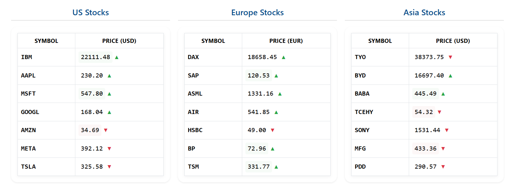

# Real-Time Stock Dashboard
📈 Real-Time Stock Dashboard
A responsive, multi-widget dashboard displaying live stock market data using WebSockets and real-time APIs.
Built with .NET and SignalR, this application serves as an excellent starter template for financial applications, trading platforms, or any real-time data visualization needs.

✨ Key Features

- Real-time updates via WebSockets (SignalR)
- Multi-region support (US, Europe, and Asia markets)
- Interactive UI with price change animations
- Health monitoring with endpoint checks
- Mock service for development/testing

🛠 Technology Stack

Backend:

- ASP.NET Core 7
- SignalR (WebSockets)
- Finnhub/AlphaVantage APIs
- Health Checks

Frontend:
- Vanilla JavaScript
- Responsive CSS (Flexbox/Grid)
- Price change animations

DevOps Ready:

- Configuration management
- API rate limiting
- HttpClient best practices

🚀 Perfect Starter For
- Trading platforms
- Financial dashboards
- Real-time data visualization apps
- Stock market simulation tools
- Fintech learning projects

🔧 Easy to Extend

This project demonstrates core real-time functionality while being intentionally modular to:

- Swap data providers (Bloomberg, IEX Cloud, etc.)
- Add authentication/authorization
- Implement historical data charts
- Connect to trading APIs

📦 Getting Started
- Clone repo
- Add Finnhub/AlphaVantage keys in your environment (for ex. in Windows run this command in console: setx FINNHUB_API_KEY "12345")
- Run dotnet run